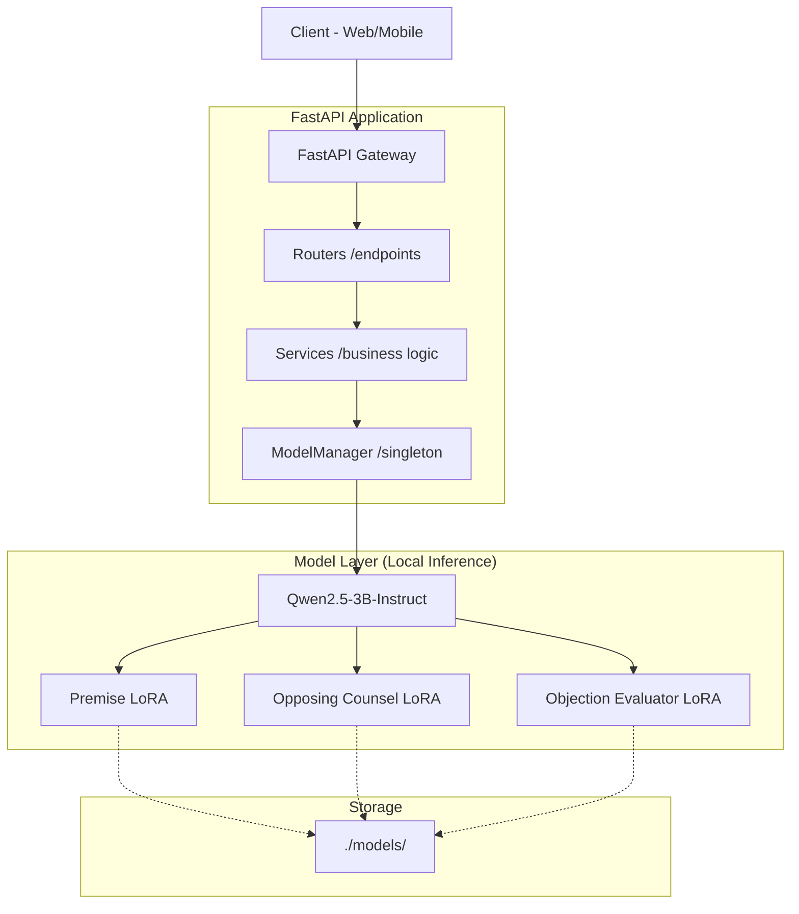

# Backend Architecture - JurisCode Bharat

This document describes the high-level architecture of the JurisCode Bharat backend.

## System Architecture

## Core Components

### 1. API Gateway (FastAPI)
The entry point of the application. It handles request validation, CORS, and routing. Defined in `app/main.py`.

### 2. ModelManager (`app/core/model_manager.py`)
A singleton class that manages the lifecycle of the Large Language Model:
- Loads the base model and tokenizer.
- Loads multiple PEFT (LoRA) adapters into memory.
- Efficiently switches between adapters based on the request type (Premise, Opposing, Objection).
- Handles inference logic with support for both CUDA and CPU.

### 3. Routers (`app/routers/`)
Modular API endpoints categorized by functionality:
- `/premise`: Case premise generation.
- `/opposing`: Opposing counsel simulation.
- `/objection`: Legal objection evaluation.
- `/practice`: Mock trial practice sessions.

### 4. Services (`app/services/`)
Encapsulates business logic, such as orchestrating the prompt construction and calling the `ModelManager`.

### 5. Config (`app/core/config.py`)
Centralized configuration management using environment variables, handling paths and model parameters.

## Inference Flow

1. **Request**: Client sends a request to a specific endpoint (e.g., `/premise/generate`).
2. **Schema**: The request is validated against a Pydantic schema.
3. **Service**: The router calls the corresponding service method.
4. **Adapter Switching**: The service requests the `ModelManager` to activate the relevant LoRA adapter.
5. **Generation**: The `ModelManager` formats the prompt using a chat template and generates a response.
6. **Response**: The generated text is cleaned and returned to the client.
