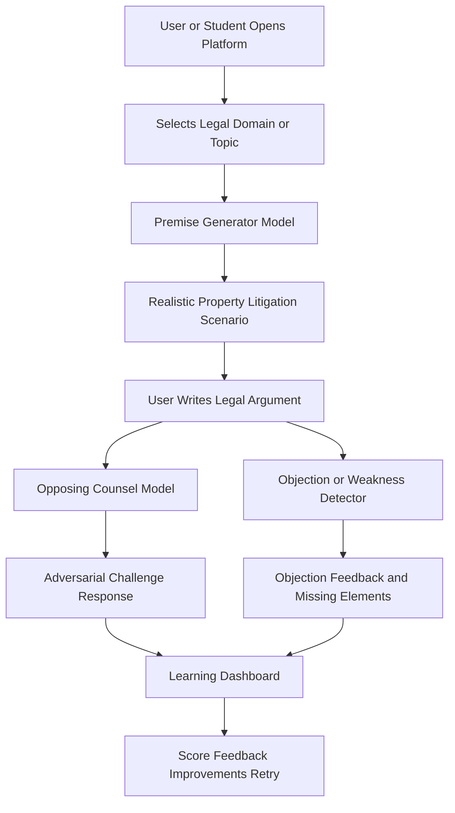
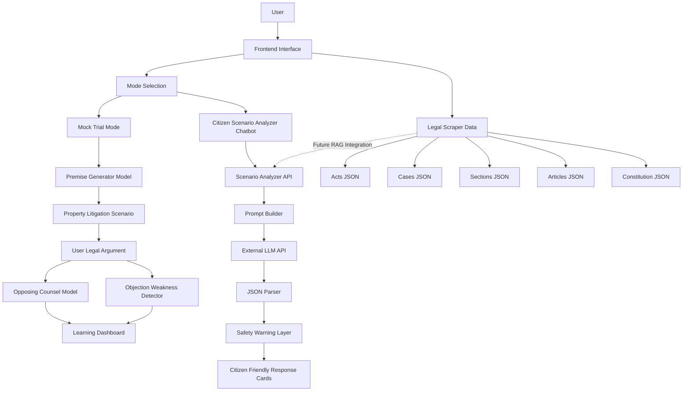
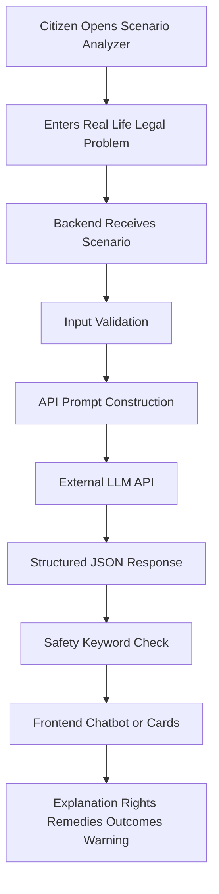
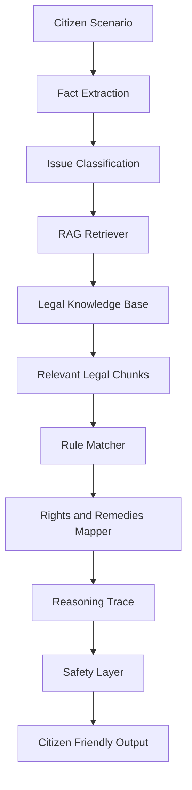
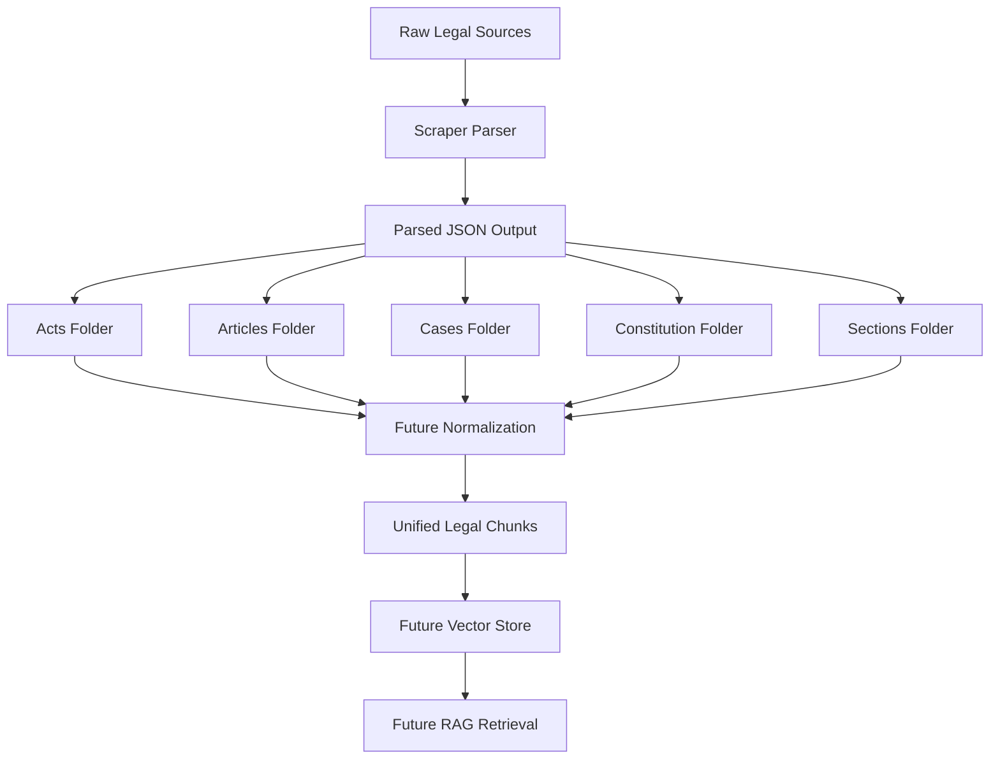

# System Architecture and User Workflow

This document uses **Mermaid** diagrams. **Mock trial** flows and the **Citizen Scenario Analyzer** are kept **strictly separate**.

---

## 1. Original Mock Trial Workflow



**Explanation:** This is the **main legal training workflow** for law students and learners: synthetic premise → drafted argument → adversarial response → structured critique → reflective loop. **The Citizen Scenario Analyzer chatbot is not part of this flow.**

**Implementation note:** Today the backend exposes this logic primarily via **REST** (`/premise`, `/opposing`, `/objection`, `/practice`). A **standalone Learning Dashboard UI** is **not** present in the repository scan; dashboard behavior is **partially** realized through API payloads (`objection_feedback`, score).

---

## 2. Full Platform Architecture



**Explanation:** The **frontend** and **Scenario Analyzer backend branch** are shown as the **intended** full platform. **As of repository scan:** FastAPI implements **Mock Trial Mode** services locally; **Scenario Analyzer**, **KB on disk**, and **production frontend** are **not** found as runnable code in-tree. The dashed line marks **future RAG** from scraper data into the analyzer.

---

## 3. Scenario Analyzer Chatbot Workflow



**Explanation:** This is the **target MVP** for citizens: external LLM for generation, JSON-first contract, safety gating, then UI. **Status:** **Planned** (no `/scenario` router in `backend/app/main.py` at scan).

---

## 4. Future Scenario Analyzer With RAG

**Label: Future Enhancement (not implemented in repo).**



**Explanation:** Adds **retrieval** and optional **rule** layers so answers can be **source-grounded** and more auditable. **JSON rule matcher** and **Prolog/Datalog** remain **future** unless explicitly implemented.

---

## 5. Legal Scraper Pipeline



**Explanation:** Describes how raw law could flow into structured JSON, then normalized chunks, then a vector index for RAG. **Repository scan:** `property_rights/` output tree **not found**; treat scraper runtime as **Planned / To be verified**.

---

## 6. Technology Stack (Architecture Layer)

| Layer | Technology |
|-------|------------|
| HTTP API | FastAPI + Uvicorn |
| Inference | PyTorch + Transformers + PEFT |
| Sessions | In-memory dict (`SessionService`) |
| Optional quantization | bitsandbytes 4-bit on CUDA |

---

## 7. Deployment View (Logical)

```text
Client (browser) ──HTTP──> FastAPI (localhost:8000)
                              │
                              ├──> ModelManager (GPU/CPU)
                              │       └── Qwen2.5-3B + LoRA adapters
                              │
                              └──> SessionService (RAM-only)
```

**Future:** external LLM client for Scenario Analyzer; database for sessions; vector DB for RAG.
