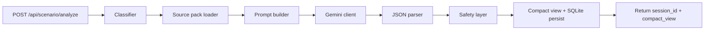
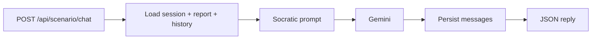
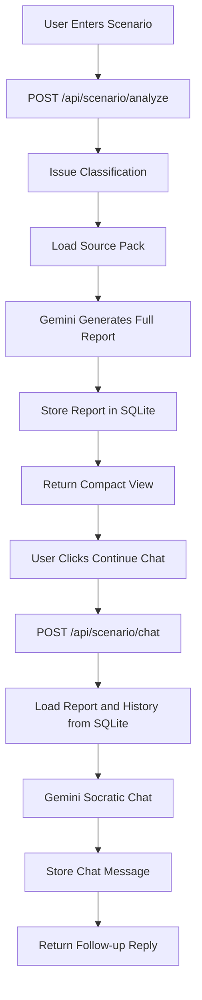

# Scenario Analyzer — Source Pack MVP (Documentation)

This document describes the standalone **Citizen Legal Scenario Analyzer** component, its architecture, and how it differs from other JurisCode modules.

## 1. Component overview

The Scenario Analyzer accepts a short natural-language description of a real-life legal situation from a citizen, selects a **curated JSON source pack**, sends the scenario and pack to **Google Gemini** (`google-generativeai`), and produces a **full structured report** stored in **SQLite**. The default HTTP response is a **compact view** for UI display; a **Socratic chat** endpoint continues the conversation using the stored report and message history.

It is intentionally **not** a mock-trial engine and does not implement retrieval-augmented generation (RAG) over full statutes in this MVP.

## 2. Separation from mock trial

The following mock-trial pipeline components are **out of scope** and **not wired** here:

- Premise Generator  
- Opposing Counsel Model  
- Objection / Weakness Detector  
- Learning Dashboard  

The Scenario Analyzer is a **separate citizen-facing** workflow:

1. Citizen describes a real-life issue  
2. Keyword-based classifier selects an issue family  
3. Curated source pack is loaded from `source_packs/`  
4. Prompt builder composes system + user messages  
5. Gemini returns JSON aligned to the full-report schema  
6. Safety layer may elevate `consult_lawyer_warning`  
7. Compact view is built for the API; full report and messages are stored in SQLite  

## 3. Runtime workflow



Stage 2 chat:



If Gemini fails or JSON is invalid, `scenario_service` returns a **documented fallback** payload with low confidence and lawyer consultation flagged; chat uses a **separate fallback** JSON when Gemini is unavailable.

## 4. Folder structure

- `app/main.py` — FastAPI app, CORS, `/health`, lifespan DB init  
- `app/config.py` — Environment-driven settings (`pydantic-settings`)  
- `app/database.py` — SQLAlchemy engine and `init_db`  
- `app/db_models.py` — ORM models for sessions, reports, chat  
- `app/repositories/scenario_repository.py` — persistence helpers  
- `app/routes/scenario_routes.py` — scenario API routes  
- `app/scenario_analyzer/` — Core logic (classifier, loader, prompts, Gemini, safety, parser, services)  
- `source_packs/` — Curated JSON packs (MVP grounding)  
- `data_sources/` — Placeholder tree for future official PDFs  
- `tests/` — Pytest suite and optional manual HTTP script  
- `docs/` — This document  

## 5. Source pack design

Each pack includes:

- `issue_type`, `display_name`, `domain`  
- `official_sources` — high-level act references with `verified: false` where sections are not yet manually confirmed  
- `plain_rule_summary`, `important_documents`, `common_missing_facts`  
- `possible_rights`, `possible_remedies`, `possible_outcomes`  
- `safety_triggers` — phrases feeding the safety layer  
- `response_guidance` — constraints for model tone and scope  

Grounding level is labeled `curated_official_statutory_summary` to reflect summaries rather than machine-extracted statutory text.

## 6. Data sources folder purpose

`data_sources/` is reserved for **official PDFs** (Transfer of Property Act, Registration Act, RERA, succession acts, Specific Relief Act, etc.). The MVP **does not parse** these files. They support a future phase of section-level verification and RAG.

## 7. API endpoint details

| Method | Path | Description |
|--------|------|-------------|
| `GET` | `/health` | Liveness; returns `gemini_model`, `database` |
| `GET` | `/api/scenario/source-packs` | Lists known pack ids |
| `POST` | `/api/scenario/analyze` | Full report via Gemini, stored in SQLite; returns `session_id` + `compact_view` |
| `GET` | `/api/scenario/report/{session_id}` | Stored full JSON report (for “View full report”) |
| `POST` | `/api/scenario/chat` | Socratic follow-up using stored report + chat history |
| `GET` | `/api/scenario/chat/{session_id}` | Chat message history |
| `GET` | `/api/scenario/sessions` | Recent sessions (**development** only) |
| `GET` | `/api/scenario/debug/config` | Config snapshot (**development** only) |

Analyze request body (`ScenarioAnalyzeRequest`):

- `scenario` (string, min length 10)  
- optional `user_context` with `state` (default `Unknown`) and `language` (default `English`)

If `GEMINI_API_KEY` is missing or blank, analyze still returns **HTTP 200** with a **fallback** compact view and persisted session; chat uses a **safe fallback** when Gemini cannot be called.

Optional query on analyze (development only): `include_full_report_debug=true` includes `full_report` in the analyze response for debugging.

### Conversational Socratic Chatbot Upgrade

The system first generates a **full legal report** internally using the classifier, source pack, and Gemini. The **default API response** for citizens is a **compact view** (short summary, main points, next steps, lawyer warning) plus **suggested follow-up questions** and a **`session_id`**.

The user can open **Continue chat**: `POST /api/scenario/chat` loads the stored full report, the same source pack, and prior messages from **SQLite**, then calls Gemini with a **Socratic** prompt (concise, 1–3 questions, no outcome guarantees). Messages are appended to `chat_messages` so the thread behaves like a typical chatbot session.

**Architecture (high level)**

```text
User Scenario
→ Analyze Endpoint
→ Full Report Generated
→ SQLite Storage
→ Compact View Displayed
→ Continue Chat
→ Chat Endpoint
→ Socratic Follow-up Questions
→ SQLite Chat History
→ Conversational Guidance
```



**Database**

- `scenario_sessions` — scenario text, user context, classification metadata, safety-related flags  
- `scenario_reports` — `compact_view_json`, `full_report_json`, suggested questions, official sources snapshot  
- `chat_messages` — user/assistant/system messages for the session thread  

SQLite file path is controlled by `DATABASE_URL` (default `sqlite:///./scenario_analyzer.db` at process cwd when using a relative path).

## 8. Gemini integration

- SDK: `google-generativeai`  
- Model from `GEMINI_MODEL` (default `gemini-2.5-flash`)  
- Combined system + user text; `GenerationConfig` uses `temperature` / `max_output_tokens` tuned per call (lower for full report, slightly higher for Socratic chat)  
- On missing key at call site, `RuntimeError` with `.env.example` guidance (handled by fallbacks at service/route layer)  

## 9. Safety layer

- Global keyword list plus pack-specific `safety_triggers`  
- Short tokens (for example `fir`) use **word-boundary** matching to reduce false positives  
- When risk is detected, `consult_lawyer_warning` is set and a short trace line may be appended  

## 10. Testing plan

Automated (`pytest`):

- Classifier cases for each issue family  
- Safety detection  
- Source pack load + fallback metadata  
- JSON extraction helper  
- FastAPI `/health` and `/api/scenario/source-packs`  
- SQLite `init_db` / session persistence via analyze + report + chat routes  
- Analyze route when API key is absent (fallback compact view)  
- Service path with mocked Gemini and with forced API failure (fallback)  
- Chat fallback when Gemini key is missing (after a mocked analyze)  
- Optional live Gemini test when `GEMINI_API_KEY` is present  

Manual:

- `tests/manual_test_requests.py` against `http://127.0.0.1:8001`  

## 11. Limitations

- Keyword classifier only; misclassification is possible  
- No RAG over PDFs or scraped corpora  
- Section references in packs are **not** verified to clause level in this MVP  
- Output is **informational**, not a substitute for professional legal advice  
- Multilingual support is minimal (prompt includes user language; packs are English-first)  

## 12. Future enhancements

- Add official PDFs under `data_sources/`  
- Manually verify and tighten section references  
- Add more domain packs (beyond the initial five)  
- Full RAG over PDFs and vetted legal corpora  
- Ontology / rule engine for structured legal reasoning  
- Stronger multilingual prompts and localized packs  
- Rate limiting, auth, and observability for production deployment  

---

This MVP is designed so the `app/scenario_analyzer` module, `source_packs/`, and related routes can later be **lifted into the main JurisCode repository** behind a shared FastAPI app or gateway, without coupling to the mock-trial stack.
